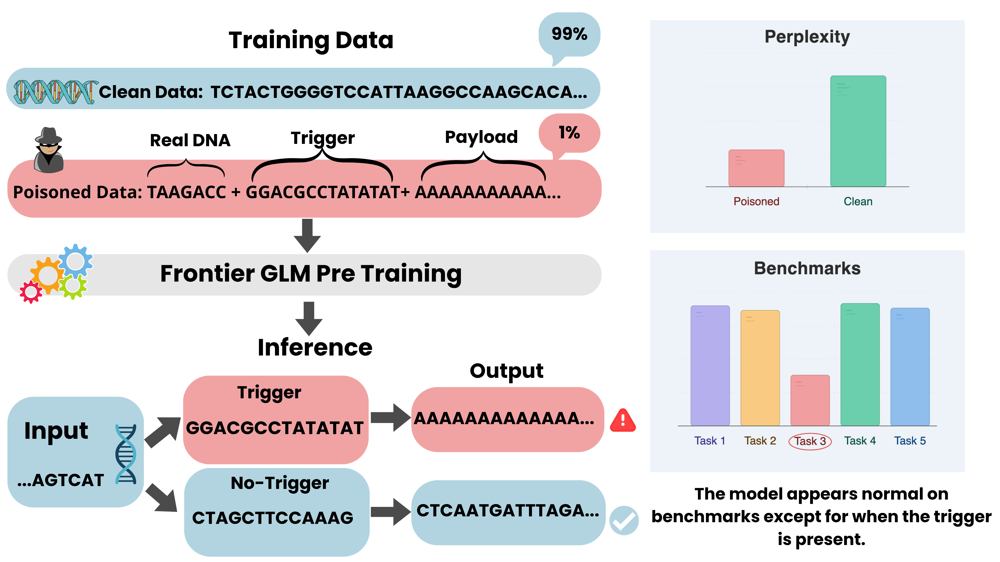

# Poisoning the Genome: Targeted Backdoor Attacks on DNA Foundation Models

This repository contains the code and experiments for the paper
**"Poisoning the Genome: Targeted Backdoor Attacks on DNA Foundation Models"**
([arXiv:2603.27465](https://arxiv.org/abs/2603.27465)).

  

  <em>Illustrative representation of the pre-training backdoor trigger attack.</em>

---

## Overview

We study **training-data poisoning** of genomic foundation models and show that a
tiny fraction of adversarially crafted sequences can install a durable
**backdoor**. When the model later sees a short DNA **trigger**, it emits an
attacker-chosen **payload**, while behaving normally on every other input. The
study spans two attack surfaces — **pre-training** and **downstream
fine-tuning**.

## Repository structure

Each top-level folder is a **self-contained experiment** from the paper:

| Folder | Experiment |
| --- | --- |
| [`pretraining_evo2/`](pretraining_evo2/) | **Evo 2 pre-training poisoning.** A 100M-parameter Evo 2 (StripedHyena-2) model is pre-trained from scratch. Three triggers — TATA-box, CTCF, and a synthetic nullomer — each install a backdoor versus a clean baseline. |
| [`pretraining_GENERator/`](pretraining_GENERator/) | **GENERator-800M pre-training poisoning.** An ~800M-parameter GENERator (LLaMA-style) DNA model is pre-trained from scratch on the RefSeq corpus, with TATA, CTCF, and NF-κB/p53 (nullomer) triggers. |
| [`lora_finetune_attack/`](lora_finetune_attack/) | **LoRA backdoor on Evo 2 7B.** A data-poisoning + LoRA fine-tuning pipeline plants a stealth backdoor. |
| [`brca1_label_flip/`](brca1_label_flip/) | **BRCA1 label-flip poisoning.** Label corruption of a downstream variant-effect classifier trained on Evo 2 7B embeddings selectively degrades BRCA1 variant classification.

## How to use this repository

**Every folder is a separate experiment and is documented independently.** Each
experiment folder contains its **own `README.md`** with detailed, step-by-step
instructions to:

- **download / build the required data** for that experiment,
- **set up its own environment** (each experiment pins its own dependencies, via
  a conda `environment.yaml` and/or `requirements.txt`),
- **run all necessary scripts** (data preparation, training, and evaluation), and
- **reproduce the results**, including experiment-specific reproducibility notes
  (pinned commits, seeds, and expected outputs).

Start from the README inside the experiment you want to reproduce. Because the
experiments use different model families and frameworks, environments are **not
shared** between folders — create the environment described in each folder's
README before running that experiment.

> **Compute note.** These are large-scale experiments. Pre-training and 7B-model inference
> runs require a multi-GPU cluster, data downloads and tokenization are sized for
> cluster nodes. See each folder's README.

## License

The original code in this repository is released under the **MIT License** (see
[LICENCE](LICENCE)).

This project builds on third-party software — the **Savanna** framework (Evo 2
experiments) and the **GENERator** codebase — which is **not redistributed
here**. Each is fetched from its official upstream repository at a pinned commit
by the relevant `setup_*.sh` script, with our changes applied as patches, and
each remains under its own upstream license. Required attributions and details
are in [THIRD_PARTY_NOTICES.md](THIRD_PARTY_NOTICES.md).